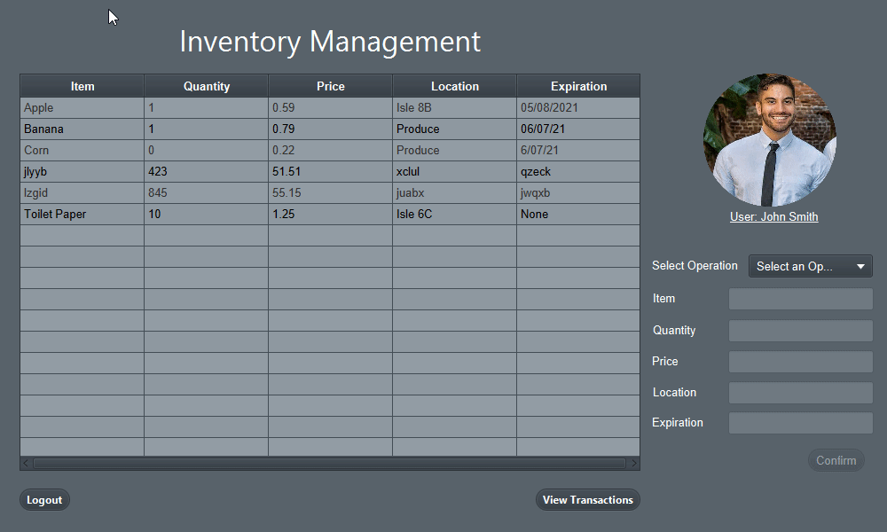

*The gif above showcases the Manager portal for inventory management*

## Description:
This project was created with the intention of displaying proper version control, co-authoring and knowledge of ORM. The project involves a SQL database which stores information regarding the inventory for a grocery store. Based off of the user either being a manager or customer different operations are avaliable to modify and view the contents of the database. 

### Version/Requirements:

- Created with Intellij, dependent on Java 1.8 with built in JavaFX
- Tied into MySQL database with JDBC (Requires local MySQL Connector)
- MySQL Database is must be hosted, following the outlined Table schema in managerController

### Login Credentials:

**Customer Login:**
- username: Customer
- password: 12345

**Manager Login:**
- username: Manager
- password: 12345

### User Guide:

To Login to the program you first need to enter a username and password, for testing purposes we have created a customer login and Manager login which are provided above. 

NOTE the Manager login has access to features that the Customer does not. To test more administrative methods such as Modifying inventory, viewing transaction history, etc, login as a Manager. To test how a customer would interact with this system please login as a customer

**If logging in as a customer:**

- The user will be greeted by a screen where there will be an inventory view with fields for the customer to choose an item and its amount, as long as that item is present in the inventory. 

- The user will then choose items from the inventory and then click the option to add to cart, the inventory is updated in real time so the customer can view how many items are left in stock. 

- Once the customer is done adding items, he or she can then select the place order button, which will then display a screen showing the name of the driver who will pick up their items, aswell as the drivers vehicle make.

- From there the customer can choose to go back and then logout or to begin the process to place another order following the same steps as above.  

**If logging in as a manager:**

- The user will be greeted by a screen which displays the inventory, a button which will display all transactions, aswell as 5 text fields and a drop box where the user can select an operation to begin modifying the inventory. 

- The Manager account has access to different operations which a normal customer account would not, these operations are to add an item, delete an item, or update an item. To begin, the user will select the drop box and choose one of the previously mentioned operations.

- If the user chooses to add an item, all text boxes will become editable and the user will continue to enter an item name, its quantity, price, location, and expiration date in the appropriate fields. Once the user has filled all the required fields he or she can then hit the confirm button to modify the inventory. The inventory is updated in real time so the user can see the item they added to the inventory. The user can then click the transaction button which will display the item name, its quantity, and that it was added to the inventory. From there the user can select the return button and then logout to return to the login screen, or try the same or different operations. 

- If the user chooses to delete an item, only the item field will become editable and the user will then enter the item name which he or she wants to remove. Once the user has entered a valid item name, meaning the item is on the list, he or she can then hit the confirm button to update the inventory and see that the item was completely removed. The user can then click the transaction button which will display the item name and that it was deleted from the inventory. From there the user can select the return button and then logout to return to the login screen, or try the same or different operations. 

- If the user chooses to update an item, all the text fields will become editable and the user will enter the item name, and fill in the fields he or she wants to update. If the user wants to add to the item quantity the user will just input the amount to add in the quantity box. If the user wants to subtract from the item quantity the user will input a minus sign (-) follwed by the number of items her or she wants to remove, ex: remove 5 would be -5. The fields price, location, and expiration can be changed by simply entering the desired value and hitting confirm. NOTE the item field cannot be changed and the item must exist in the inventory. Once updating the desired values the user can then click the transaction button to view any changes made to the items quantity. From there the user can select the return button and then logout to return to the login screen, or try the same or different operations.

#### Group Members:
- Moussa Dastgheib
- Khalid Farhoud
- Isabel Madrigal
- Alan Weikman
